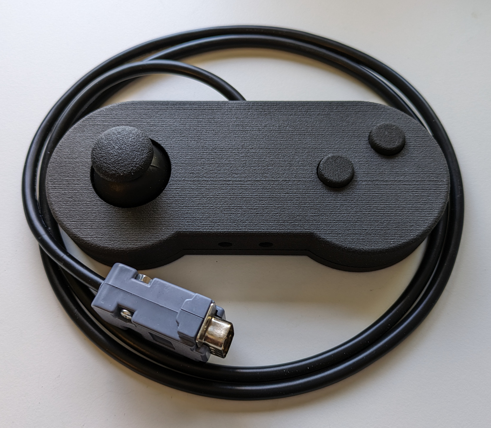
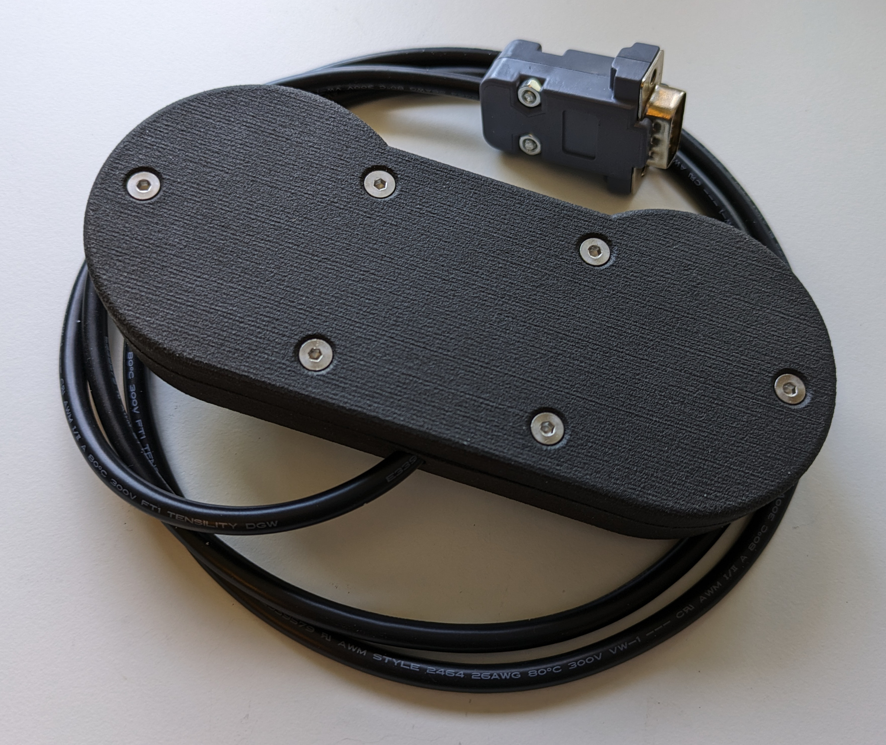
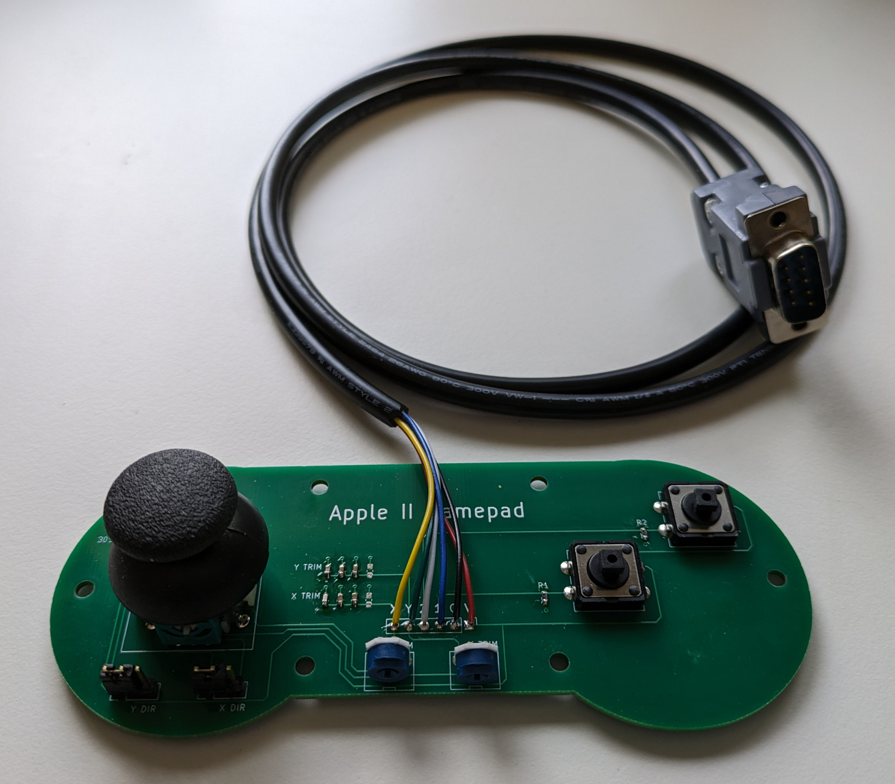

# Apple II Gamepad

This project contains the PCB design and CAD design for an Apple II Gamepad more in the general style of an SNES controller.

[KiCAD](pcb/) and [FreeCAD](enclosure/) design files are available, as well as [exported](export/) gerbers and STL files suitable for PCB manufacturing and 3D printing.

The electrical design is based largely on information collected and presented in this very helpful [Blondihacks Blog Post](https://blondihacks.com/apple-ii-gamepad-prototype/).

I've manufactured the enclosure with a Prusa MK4 3d Printer (in PLA) as well as via JLCPCB's 3d printing service (in nylon using an SLS process).

### Photos of a fully assembled gamepad

### PCB Components

1x [Two Axis Thumbstuck, Sparkfun](https://www.digikey.com/en/products/detail/sparkfun-electronics/COM-09032/6823623)

2x [Tactile Switch, CUI Devices, TS13-1212-73-BK-160-D](https://www.digikey.com/en/products/detail/cui-devices/TS13-1212-73-BK-160-D/16562837)

2x [Trimmer, 5K, Bournes 3306W-1-502](https://www.digikey.com/en/products/detail/bourns-inc/3306W-1-502/84764)

2x Resistor, 0603, 470 ohm

6x Capacitor, 0603, 100nF (may need adjusting)

2x Header, 0.1", 3 pin

2x Jumper, 0.1"

1x Cable, 6 conductor, ~1 meter

1x DB9 M connector and enclosure

6x Brass heat-set M3 inserts

6x M3 screws

### Limitations

The unit I fully assmbled and tested with an Apple IIe (enhanced), reads 149/135 with the thumbstick in the center position.
The trimmers can increase but not decrease this value.
Adjusting the capacitance should allow more control, but that has to be done by adding/remove capacitors.
As-is, it works great with Lode Runner, and has not been tested extensively otherwise.

### Todo List for Future Revisions

1. A switch to swap buttons

2. A switch or jumper to enable thumbstick button

3. Adjustable Capacitors of some?
